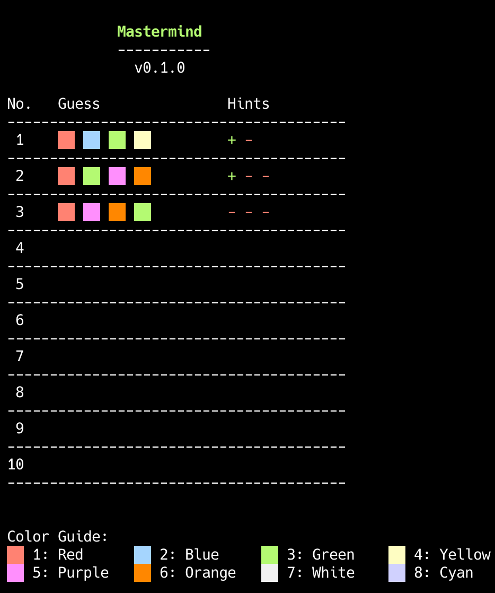
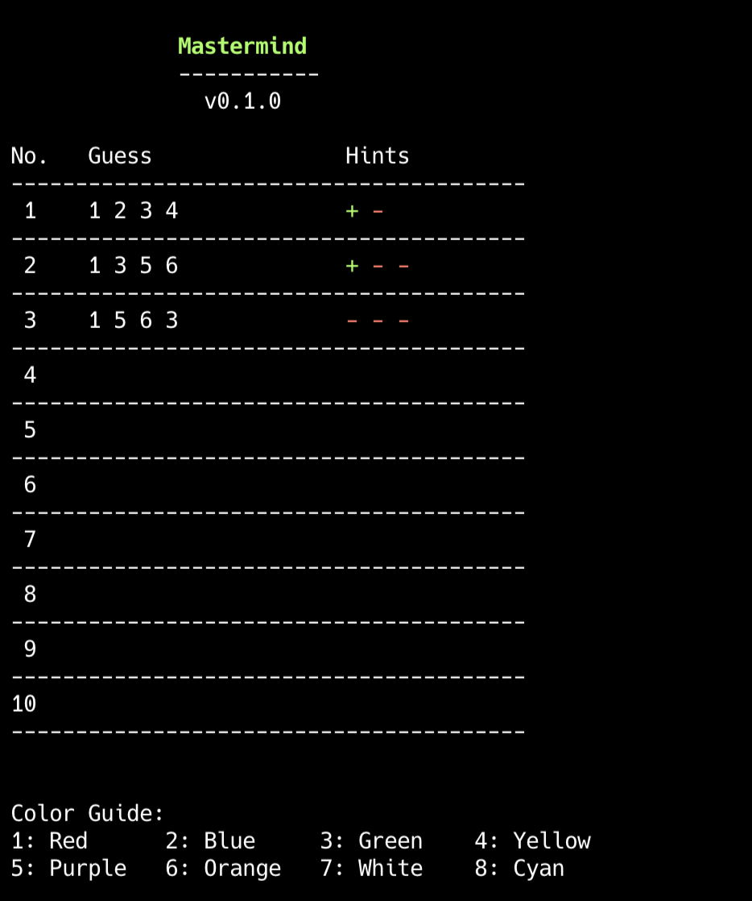

# Mastermind Game

## Introduction

Mastermind is a classic code-breaking game where players attempt to guess a randomly generated color sequence within a limited number of tries. This version of Mastermind uses 8 different colors, and players need to guess the correct order of 4 colors. The game supports two display modes: colored blocks and numbers.

## How to Play

1. At the start of the game, the computer randomly generates a sequence of 4 different colors.
2. Players have 10 attempts to guess this color sequence.
3. After each guess, the game provides feedback:
   - A green plus (+) indicates a correct color in the correct position
   - A red minus (-) indicates a correct color in the wrong position
4. Players can adjust their guessing strategy based on this feedback.
5. If the correct color sequence is guessed within 10 attempts, the player wins.
6. If the correct sequence is not guessed after 10 attempts, the game ends, and the computer reveals the correct answer.

## Color Options

The game uses 8 colors: 
```
1. Red,    2. Blue,    3. Green,    4. Yellow
5. Purple, 6. Orange,  7. White,    8. Cyan
```
Players need to input the corresponding number (1-8) to select a color.

## Game Screenshot

色块模式和数字模式对比
<div style="display: flex; justify-content: space-between;">
    
    
</div>

## Game Controls

- Enter 4 different numbers (1-8) to guess the color sequence.
- Enter 'q' or 'Q' at any time to quit the game.
- Enter 'r' or 'R' at any time to toggle the display mode between colored blocks and numbers.
- After each game, you can choose to play again.
- By default, the game displays colors using colored blocks. To use numbers to represent colors, add the `-n` parameter when starting the game.

## Color Display Modes

The game supports two color display modes:
1. Colored Block Mode (default): Uses colored blocks to visually represent colors.
2. Number Mode: Uses numbers (1-8) to represent different colors.

To use the number mode, add the `-n` parameter when starting the game.

## Command Line Options

- `-n`: Use numbers instead of color blocks to represent colors
- `-h`: Display help information and usage instructions
- `-v`: Display version information


